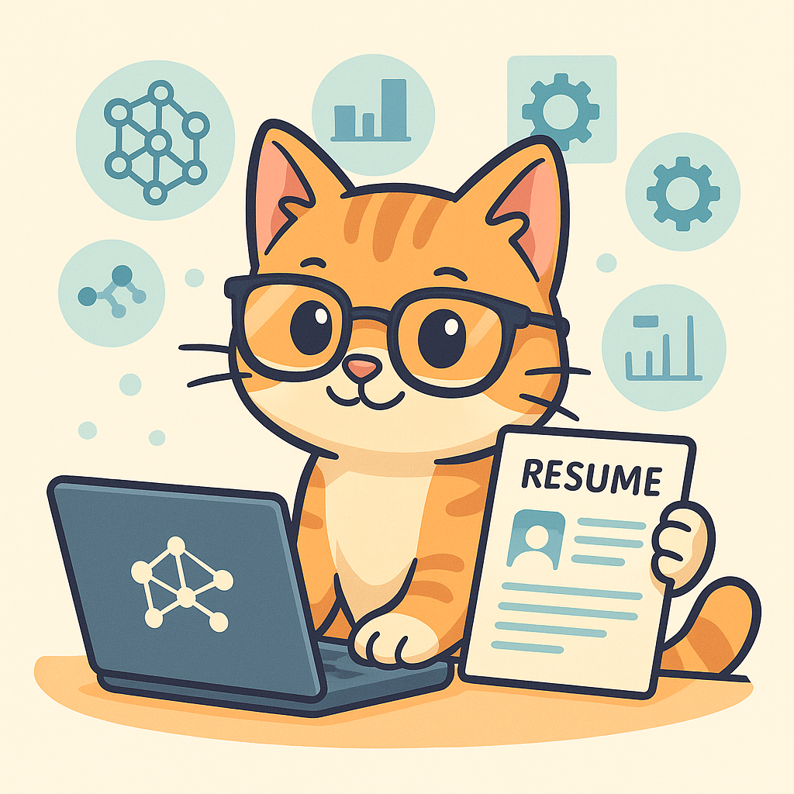

# CV-Analyzer: Анализ компетенций по матрице Альянса ИИ

---
- Проект по хакатону от Газпром Нефти и СПбГЭУ
- Интерактивное веб-приложение на базе Streamlit для автоматизированного анализа резюме и определения уровня владения ИИ-компетенциями. Основано на модели, обученной по матрице компетенций Альянса ИИ, с возможностью персонализированных рекомендаций, визуализации соответствия профессиям и интеграцией GitHub-профиля пользователя, а также разделением на 2 пути: путь кандидата и путь HR-специалиста, в котором можно просматривать кандидатов, а также автоматизированно отправлять ревью.
---

<p align="center">
  
</p>

## 🔗 Ссылки

[Веб‑приложение](https://cv-analyzer-gpn.ru/) [](https://cv-analyzer-gpn.ru/)

[Документация в Google Docs](https://docs.google.com/document/d/1lgbiqXAzj9J_sWFw-ep4w4qTQOpA2A_-5ieAzwoP62M/edit?tab=t.0)
[](https://docs.google.com/document/d/1lgbiqXAzj9J_sWFw-ep4w4qTQOpA2A_-5ieAzwoP62M/edit?tab=t.0)

[Презентация по хакатону](https://drive.google.com/file/d/1lXNkq6ADhXyugW23C4b5t-7YkujMGFh8/view?usp=sharing) ОБНОВИТЬ ПРЕЗЕНТАЦИЮ
[](https://drive.google.com/file/d/1lXNkq6ADhXyugW23C4b5t-7YkujMGFh8/view?usp=sharing)

[UI-дизайн в Figma](https://www.figma.com/proto/TxoDBBFjM9KUHfCgTVmDLb/GPN_final?node-id=2-780&t=gy4Vn8H3mLjulGLf-1)
[](https://www.figma.com/proto/TxoDBBFjM9KUHfCgTVmDLb/GPN_final?node-id=2-780&t=gy4Vn8H3mLjulGLf-1)

## Стек анализируемых профессий в соответствии с матрицей [Альянса ИИ](https://a-ai.ru/)

- Аналитик данных (Data scientist, ML engineer)
- Менеджер в ИИ (Manager in AI)
- Технический аналитик в ИИ (Technical analyst in AI)
- Инженер данных (Data engineer)

[Сама матрица](https://drive.google.com/file/d/1gRqcL8P2G36LzYTTkSae8-0F_nW6LbDj/view?usp=sharing)

---

## Как пользоваться CV-Analyzer
CV-Analyzer – это веб-сервис для автоматизированного анализа резюме и рассылки кандидатов по результатам. Просто откройте ссылку на приложение в браузере и следуйте инструкции.
> ---
> ## Инструкция
> ### 1. Выбор роли
> 
> При запуске вы увидите экран выбора роли:
> 
> - **Кандидат** — заполнить форму, загрузить резюме и получить подтверждение.  
> - **HR-специалист** — отфильтровать заявки, посмотреть статистику и отправить письма.
> 
> Нажмите «Продолжить» после выбора.
> 
> ---
> 
> ### 2. Поток кандидата
> 
> 1. **Заполнение формы**  
>    - Введите фамилию, имя, отчество.  
>    - Укажите email, Telegram-ник и телефон (+7XXXXXXXXXX).  
>    - Выберите до двух профессий из списка.  
>    - Дайте согласие на обработку персональных данных.  
>    - Нажмите **Продолжить к загрузке резюме**.
> 
> 2. **Загрузка резюме**  
>    - Загрузите файл (PDF, DOCX или TXT, не более 10 MB).  
>    - Сервис извлечёт текст и авто-определит GitHub-ссылки.
> 
> 3. **Оценка компетенций**  
>    - Слева — предсказание модели (0–1), справа — выбор вашего уровня (0–3).  
>    - Подтвердите грейды и нажмите **Отправить заявку**.
> 
> 4. **Подтверждение**  
>    - Если всё заполнено верно, вы увидите номер заявки и получите письмо на ваш email.
> 
> ---
> 
> ### 3. Поток HR-специалиста
> 
> 1. **Вход**  
>    - Введите пароль HR (по умолчанию `duduki`).
> 
> 2. **Общая панель**  
>    - Вкладки для каждой профессии + «Общая сводка» с графиками и метриками.
> 
> 3. **Фильтры**  
>    Откройте «🔍 Фильтры» и задайте:  
>    - Диапазон дат загрузки резюме.  
>    - Email HR (если нужно).  
>    - Наличие GitHub.  
>    - Обязательные компетенции по грейдам.  
>    - Вторую профессию (или «Не важно»).  
>    - Диапазон % соответствия и сортировку.
> 
> 4. **Просмотр прошедших**  
>    - В поле «Порог % для массовой рассылки» укажите порог (например, 80 %).  
>    - Нажмите **Показать прошедших** — появятся статистика и список кандидатов, набравших ≥ порога:  
>      - Всего кандидатов  
>      - Кандидатов ≥ порога  
>      - Доля прошедших  
>    - Под таблицей — подсказка:  
>      > Нажмите кнопку «📤 Отправить письма», чтобы разослать уведомления выбранным кандидатам.
> 
> 5. **Полный список**  
>    Под списком прошедших всегда доступен полный перечень всех кандидатов по вакансии.
> 
> 6. **Массовая рассылка**  
>    - После проверки списка и статистики нажмите **📤 Отправить письма**.  
>    - Сервис автоматически разошлёт письма «Поздравляем!» тем, кто выше порога, и «Спасибо за участие» тем, кто ниже.
> 
> ---
> 
> ### 4. Общая сводка
> 
> Перейдите на вкладку **Общая сводка**, чтобы увидеть:  
> - Всего заявок и заявки за последнюю неделю  
> - Средний % соответствия  
> - Долю с GitHub  
> - Число уникальных HR  
> - Среднюю задержку между формой и загрузкой  
> - Графики и топ-5 компетенций по грейдам  
> 
> ---
> 
> Спасибо, что используете CV-Analyzer! ^-^

## База данных на базе контейнера Docker и Postgre
[PGWEB для доступа к БД](https://cv-analyzer-gpn.ru/pgweb/)

- PostgreSQL и PGWEB развернуты в Docker‑контейнерах; к PGWEB можно обратиться по пути `/pgweb` на нашем домене, с обязательной авторизацией (логин/пароль).
> Логин и пароль появятся 28 мая!

## Уникальность

Полностью контейнеризированное решение: приложение, PostgreSQL и PGWEB развёрнуты через Docker, что упрощает развёртывание и масштабирование. PGWEB доступен по маршруту `/pgweb` на домене.

**Ключевые преимущества:**
- Глубокий NLP‑контекст + скоринг XLM‑RoBERTa по 34 компетенциям  
- Два интерфейса в одном: самооценка кандидата и аналитический дашборд для HR  
- Автоматическая рассылка писем через Gmail API с адаптивными рекомендациями  
- Полный MLOps‑контур: кеширование, CI/CD, мониторинг и авто‑переобучение моделей  

## ML-схема (реализована частисно, остальная часть теоретический вариант развития продукта)
<div align="center">
  
</div>

## Структура проекта

```plaintext
CV-ANALYZER-GAZPROM-NEFT/
├── .devcontainer/    # Конфигурация среды разработки Dev Container
│   └── devcontainer.json
├── .streamlit/       # Настройки Streamlit (конфиг и секреты)
│   ├── config.toml
│   └── secrets.toml
├── logs/             # Логи ошибок приложения
│   └── errors.log
├── others/           # Различные ресурсы (изображения, ноутбуки, датасеты)
│   ├── cat.jpg
│   ├── final-file.ipynb
│   ├── logo.png
│   ├── ML-схема.png
│   ├── resume_dataset.csv
│   └── Оптимизация+парсинг_из_гитхаба.ipynb
├── temp/             # Временные файлы при обработке резюме
├── utils/            # Вспомогательные модули и логика
│   ├── __pycache__/  # Скомпилированные файлы Python
│   │   ├── __init__.cpython-310.pyc
│   │   ├── constants.cpython-310.pyc
│   │   ├── cv_reader.cpython-310.pyc
│   │   └── github_reader.cpython-310.pyc
│   ├── __init__.py
│   ├── cached_app_utils.py  # Кэшированные утилиты Streamlit
│   ├── constants.py         # Константы: компетенции, матрицы, шаблоны
│   ├── cv_reader.py         # Извлечение и предобработка текста резюме
│   ├── email.py             # Логика работы с отправкой писем
│   └── github_reader.py     # Парсинг и сбор текста с GitHub
├── .gitignore        # Правила игнорирования для Git
├── app.py            # Основное Streamlit-приложение
├── client_secret_2_496304292584-focgmts10r0pc3cplngprpkiqshp5d2j.apps.googleusercontent.com.json  # OAuth-файл клиента
├── Dockerfile        # Образ контейнера для деплоя
├── README.md         # Описание проекта и инструкции
├── requirements.txt  # Зависимости Python
└── token.json        # Сохранённые OAuth-токены
```

## Requirements

```bash
streamlit
pandas
psycopg2-binary
torch
transformers
huggingface-hub
matplotlib
seaborn
scikit-learn
numpy
pdfminer.six
python-docx
requests
mplcyberpunk
lime
streamlit-aggrid
google-auth-oauthlib
google-auth-httplib2
google-api-python-client
```

## Проблематика и целевая аудиторий

| **Проблематика**                                                                              | **Целевая аудитория**                                           |
|-----------------------------------------------------------------------------------------------|-----------------------------------------------------------------|
| **Сложности с подбором IT‑специалистов**<br>Компании не успевают находить кандидатов с актуальными навыками.     | • Руководители отделов<br>• Технические интервьюеры             |
| **Разрыв образования и рынка**<br>Учебные программы вузов и онлайн‑курсов отстают от трендов Big Data, ИИ, DevOps. | • HR‑специалисты и рекрутеры<br>• Аналитики по подбору персонала |
| **Необходимость автоматизации**<br>При большом потоке резюме сложно оперативно отобрать лучших кандидатов.      |                                                                 |


## Функции и преимущества

| **Функции**                                                                                                | **Преимущества**                                                   |
|------------------------------------------------------------------------------------------------------------|--------------------------------------------------------------------|
| • Сопоставление компетенций кандидатов с требованиями вакансий                                             | • Снижение времени на отбор кандидатов                             |
| • Генерация персональных карьерных рекомендаций                                                            | • Повышение точности и релевантности подбора                       |
| • Автоматизация обратной связи кандидатам и сотрудникам                                                    | • Сокращение затрат на внешних рекрутеров                          |
| • Анализ и прогнозирование карьерных траекторий сотрудников                                                 | • Оптимизация обучения и повышения квалификации                    |
| • Предложение курсов и сертификаций для устранения «skill‑gap»                                              | • Повышение качества обратной связи                                |
|                                                                                                            | • Улучшение долгосрочной карьерной стратегии сотрудников           |

---

## Наша команда

<div align="center">
  <table>
    <tr>
      <td align="center">
        
        <p><strong>Егор</strong><br/><a href="https://github.com/KsyLight">KsyLight</a></p>
      </td>
      <td align="center">
        
        <p><strong>Аким</strong><br/><a href="https://github.com/Akim-norfeg">Akim-norfeg</a></p>
      </td>
      <td align="center">
        
        <p><strong>Максим</strong><br/><a href="https://github.com/Swagozavr">Swagozavr</a></p>
      </td>
      <td align="center">
        
        <p><strong>Катя</strong><br/><a href="https://github.com/klevkina">klevkina</a></p>
      </td>
      <td align="center">
        
        <p><strong>Аня</strong><br/><a href="https://github.com/kwarkw">kwarkw</a></p>
      </td>
    </tr>
  </table>
</div>

<div align="center">
  
</div>
